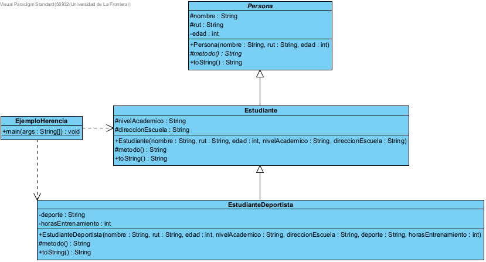

# Implicancias-de-la-Herencia
Guía de trabajo - Caso de Estudio: Herencia - Personas, Estudiantes y Deportistas

Implementación de una jerarquía de herencia en Java con las clases `Persona`, `Estudiante` y `EstudianteDeportista`.

---

## Diagrama de Clases

---

## Clases

- **Persona** — clase abstracta base con nombre, rut y edad
- **Estudiante** — extiende Persona, agrega nivel académico y dirección
- **EstudianteDeportista** — extiende Estudiante, agrega deporte y horas de entrenamiento
- **EjemploHerencia** — clase principal que prueba la jerarquía
